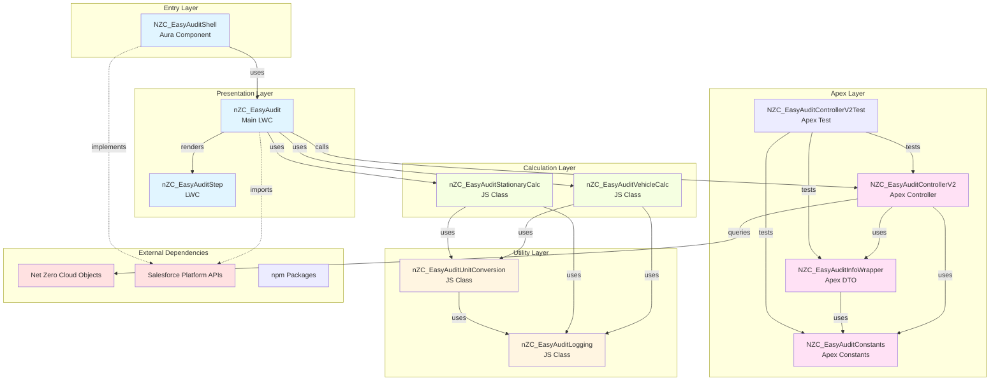

# Dependency Chart - NZC EasyAudit

Generated: January 27, 2026

## Overview

This document provides a comprehensive dependency analysis of the NZC EasyAudit repository, including:
- External npm dependencies
- Salesforce platform dependencies
- Internal code dependencies (Apex, LWC, Aura)

---

## 1. External Dependencies (npm)

### Development Dependencies

```
@lwc/eslint-plugin-lwc (^3.1.0)
├── Used for: LWC linting rules
└── Dependencies: ESLint ecosystem

@prettier/plugin-xml (^3.4.1)
├── Used for: XML formatting (metadata files)
└── Dependencies: Prettier

@salesforce/eslint-config-lwc (^4.0.0)
├── Used for: Salesforce LWC ESLint configuration
└── Dependencies: ESLint, @lwc/eslint-plugin-lwc

@salesforce/eslint-plugin-aura (^3.0.0)
├── Used for: Aura component linting
└── Dependencies: ESLint

@salesforce/eslint-plugin-lightning (^2.0.0)
├── Used for: Lightning component linting
└── Dependencies: ESLint

@salesforce/sfdx-lwc-jest (^7.0.2)
├── Used for: LWC unit testing with Jest
└── Dependencies: Jest, @salesforce/lwc-jest

eslint (^9.29.0)
├── Used for: JavaScript/TypeScript linting
└── Dependencies: None (core)

eslint-plugin-import (^2.31.0)
├── Used for: Import/export linting rules
└── Dependencies: ESLint

eslint-plugin-jest (^28.14.0)
├── Used for: Jest test linting
└── Dependencies: ESLint

husky (^9.1.7)
├── Used for: Git hooks management
└── Dependencies: None

lint-staged (^16.1.2)
├── Used for: Run linters on staged files
└── Dependencies: None

prettier (^3.5.3)
├── Used for: Code formatting
└── Dependencies: None

prettier-plugin-apex (^2.2.6)
├── Used for: Apex code formatting
└── Dependencies: Prettier
```

### Dependency Tree Visualization

```
package.json
├── Dev Dependencies
│   ├── ESLint Ecosystem
│   │   ├── eslint (^9.29.0)
│   │   ├── @salesforce/eslint-config-lwc (^4.0.0)
│   │   │   └── @lwc/eslint-plugin-lwc (^3.1.0)
│   │   ├── @salesforce/eslint-plugin-aura (^3.0.0)
│   │   ├── @salesforce/eslint-plugin-lightning (^2.0.0)
│   │   ├── eslint-plugin-import (^2.31.0)
│   │   └── eslint-plugin-jest (^28.14.0)
│   ├── Prettier Ecosystem
│   │   ├── prettier (^3.5.3)
│   │   ├── @prettier/plugin-xml (^3.4.1)
│   │   └── prettier-plugin-apex (^2.2.6)
│   ├── Testing
│   │   └── @salesforce/sfdx-lwc-jest (^7.0.2)
│   └── Git Hooks
│       ├── husky (^9.1.7)
│       └── lint-staged (^16.1.2)
```

---

## 2. Salesforce Platform Dependencies

### Net Zero Cloud Objects

```
Net Zero Cloud Platform
├── VehicleAssetEnrgyUse
│   ├── Fields: FuelConsumption, FuelConsumptionUnit, FuelType, Distance, DistanceUnit, etc.
│   └── Relationships:
│       ├── VehicleAssetEmssnSrc (parent)
│       └── OtherEmssnFctr (emission factors)
│
├── StnryAssetEnrgyUse
│   ├── Fields: FuelConsumption, FuelConsumptionUnit, FuelType, PowerUsageEffectiveness, etc.
│   └── Relationships:
│       ├── StnryAssetEnvrSrc (parent)
│       ├── OtherEmssnFctr (emission factors)
│       ├── ElectricityEmissionFactors
│       └── RefrigerantEmssnFctr
│
├── OtherEmssnFctrSetItem
│   ├── Fields: Co2EmissionFactor, Ch4EmissionFactor, N2oEmissionFactor, CalorificValue
│   └── Relationships:
│       └── ParentEmissionFactorId → OtherEmssnFctrSet
│
├── OtherEmssnFctrSet
│   ├── Fields: Ch4GlblWarmingPot, N2oGlblWarmingPot
│   └── Used by: OtherEmssnFctrSetItem
│
├── ElectricityEmssnFctrSet
│   ├── Fields: Co2eEmissionRate, LocationBasedBiomassMixPct, MarketBasedBiomassMixPct
│   └── Used by: StnryAssetEnrgyUse
│
├── RefrigerantEmssnFctr
│   ├── Fields: GlblWarmingPotInKgCo2eKg
│   └── Used by: StnryAssetEnrgyUse
│
├── SustnUomConversion
│   ├── Fields: FuelType, SourceUom, TargetUom, ConversionFactor
│   └── Used for: Custom fuel/unit conversions
│
├── FuelType
│   ├── Fields: MasterLabel, DeveloperName
│   └── Used for: Custom fuel type definitions
│
└── SustainabilityUom
    ├── Fields: MasterLabel, DeveloperName
    └── Used for: Custom unit of measure definitions
```

### Salesforce Platform APIs

```
Salesforce Platform (API v65.0)
├── Lightning Web Components Framework
│   ├── lwc (LightningElement, api, track)
│   └── @salesforce/apex (Apex method imports)
│
├── Aura Framework
│   ├── force:hasRecordId (interface)
│   └── flexipage:availableForRecordHome (interface)
│
└── Apex Platform
    ├── System classes (Url, Schema, etc.)
    └── SOQL queries (WITH USER_MODE)
```

---

## 3. Internal Code Dependencies

### Component Dependency Graph

```
┌─────────────────────────────────────────────────────────────┐
│                    Entry Point Layer                        │
└─────────────────────────────────────────────────────────────┘
                              │
                              ▼
        ┌─────────────────────────────────────┐
        │  NZC_EasyAuditShell (Aura)          │
        │  - Implements: force:hasRecordId    │
        │  - Implements: flexipage:...        │
        └─────────────────────────────────────┘
                              │
                              │ uses
                              ▼
        ┌─────────────────────────────────────┐
        │  nZC_EasyAudit (LWC)                 │
        │  - Main orchestrator component       │
        └─────────────────────────────────────┘
                              │
        ┌─────────────────────┼─────────────────────┐
        │                     │                     │
        │ calls Apex          │ uses                │ uses
        │                     │                     │
        ▼                     ▼                     ▼
┌──────────────────┐  ┌──────────────────┐  ┌──────────────────┐
│ NZC_EasyAudit    │  │ NZC_EasyAudit    │  │ nZC_EasyAuditStep│
│ ControllerV2     │  │ VehicleCalc      │  │ (LWC)            │
│ (Apex)           │  │ (JS Class)        │  │                  │
└──────────────────┘  └──────────────────┘  └──────────────────┘
        │                     │
        │ uses                │ uses
        │                     │
        ▼                     ▼
┌──────────────────┐  ┌──────────────────┐
│ NZC_EasyAudit    │  │ nZC_EasyAudit    │
│ InfoWrapper      │  │ Logging          │
│ (Apex DTO)       │  │ (JS Class)       │
└──────────────────┘  └──────────────────┘
        │                     │
        │ uses                │
        │                     │
        ▼                     │
┌──────────────────┐          │
│ NZC_EasyAudit    │          │
│ Constants        │          │
│ (Apex)           │          │
└──────────────────┘          │
                              │
                              │ uses
                              ▼
                    ┌──────────────────┐
                    │ nZC_EasyAudit    │
                    │ UnitConversion   │
                    │ (JS Class)       │
                    └──────────────────┘
                              │
                              │ uses
                              ▼
                    ┌──────────────────┐
                    │ nZC_EasyAudit    │
                    │ Logging          │
                    │ (JS Class)       │
                    └──────────────────┘
```

### Detailed Dependency Matrix

#### Apex Classes

| Class | Depends On | Used By |
|-------|------------|---------|
| `NZC_EasyAuditControllerV2` | `NZC_EasyAuditInfoWrapper`<br>`NZC_EasyAuditConstants`<br>Net Zero Cloud Objects | `nZC_EasyAudit` (LWC) |
| `NZC_EasyAuditInfoWrapper` | `NZC_EasyAuditConstants`<br>Net Zero Cloud Objects | `NZC_EasyAuditControllerV2`<br>`nZC_EasyAuditVehicleCalc`<br>`nZC_EasyAuditStationaryCalc` |
| `NZC_EasyAuditConstants` | None | `NZC_EasyAuditControllerV2`<br>`NZC_EasyAuditInfoWrapper`<br>`NZC_EasyAuditControllerV2Test` |
| `NZC_EasyAuditControllerV2Test` | `NZC_EasyAuditControllerV2`<br>`NZC_EasyAuditInfoWrapper`<br>`NZC_EasyAuditConstants`<br>Net Zero Cloud Objects | None (test class) |

#### Lightning Web Components

| Component | Depends On | Used By |
|-----------|------------|---------|
| `nZC_EasyAudit` | `NZC_EasyAuditControllerV2` (Apex)<br>`nZC_EasyAuditVehicleCalc` (JS)<br>`nZC_EasyAuditStationaryCalc` (JS)<br>`nZC_EasyAuditStep` (LWC) | `NZC_EasyAuditShell` (Aura) |
| `nZC_EasyAuditStep` | None (standalone) | `nZC_EasyAudit` (LWC) |
| `nZC_EasyAuditVehicleCalc` | `nZC_EasyAuditLogging` (JS)<br>`nZC_EasyAuditUnitConversion` (JS) | `nZC_EasyAudit` (LWC) |
| `nZC_EasyAuditStationaryCalc` | `nZC_EasyAuditLogging` (JS)<br>`nZC_EasyAuditUnitConversion` (JS) | `nZC_EasyAudit` (LWC) |
| `nZC_EasyAuditLogging` | None (standalone) | `nZC_EasyAuditVehicleCalc`<br>`nZC_EasyAuditStationaryCalc`<br>`nZC_EasyAuditUnitConversion` |
| `nZC_EasyAuditUnitConversion` | `nZC_EasyAuditLogging` (JS) | `nZC_EasyAuditVehicleCalc`<br>`nZC_EasyAuditStationaryCalc` |

#### Aura Components

| Component | Depends On | Used By |
|-----------|------------|---------|
| `NZC_EasyAuditShell` | `nZC_EasyAudit` (LWC)<br>`force:hasRecordId` (interface)<br>`flexipage:availableForRecordHome` (interface) | Lightning Pages |

---

## 4. Data Flow Dependencies

```
User Interaction
    │
    ▼
Lightning Page (Salesforce UI)
    │
    ▼
NZC_EasyAuditShell (Aura)
    │ passes recordId
    ▼
nZC_EasyAudit (LWC)
    │ calls @salesforce/apex
    ▼
NZC_EasyAuditControllerV2.getRecordInfo()
    │ queries Net Zero Cloud objects
    │ creates wrapper
    ▼
NZC_EasyAuditInfoWrapper (DTO)
    │ returned to LWC
    ▼
nZC_EasyAudit (LWC)
    │ determines record type
    │ instantiates calculation class
    ├── VehicleAssetEnrgyUse → NZC_EasyAuditVehicleCalc
    └── StnryAssetEnrgyUse → NZC_EasyAuditStationaryCalc
    │
    ├─→ NZC_EasyAuditVehicleCalc
    │   │ uses
    │   ├─→ nZC_EasyAuditLogging (creates steps)
    │   └─→ nZC_EasyAuditUnitConversion (converts units)
    │       │ uses
    │       └─→ nZC_EasyAuditLogging (logs conversions)
    │
    └─→ NZC_EasyAuditStationaryCalc
        │ uses
        ├─→ nZC_EasyAuditLogging (creates steps)
        └─→ nZC_EasyAuditUnitConversion (converts units)
            │ uses
            └─→ nZC_EasyAuditLogging (logs conversions)
    │
    │ returns calculation steps array
    ▼
nZC_EasyAudit (LWC)
    │ renders steps
    ▼
nZC_EasyAuditStep (LWC) × N
    │ displays each step
    ▼
User sees calculation audit trail
```

---

## 5. Circular Dependency Analysis

✅ **No circular dependencies detected**

All dependencies flow in a unidirectional manner:
- Apex → LWC (data flow)
- LWC → JS Classes (calculation logic)
- JS Classes → JS Utilities (helper functions)
- LWC → LWC (component composition)

---

## 6. Dependency Risk Assessment

### High Risk Dependencies
- **Net Zero Cloud Objects**: External platform dependency
  - Risk: Platform changes could break functionality
  - Mitigation: Version pinning, comprehensive tests

### Medium Risk Dependencies
- **Salesforce Platform APIs**: Framework dependencies
  - Risk: API version changes (currently v65.0)
  - Mitigation: Regular updates, testing on new API versions

### Low Risk Dependencies
- **npm Dev Dependencies**: Development tooling
  - Risk: Breaking changes in minor versions
  - Mitigation: Version pinning, regular updates

---

## 7. Dependency Summary Statistics

- **Total External npm Packages**: 13
- **Salesforce Platform Objects**: 9 Net Zero Cloud objects
- **Apex Classes**: 4 (3 production + 1 test)
- **LWC Components**: 6
- **Aura Components**: 1
- **JavaScript Classes**: 3 (calculation/logging utilities)
- **Total Internal Components**: 14

---

## 8. Mermaid Dependency Diagram



---

## 9. Import/Export Analysis

### Apex Imports
- None (all classes are in the same namespace)

### LWC Imports
```javascript
// nZC_EasyAudit.js
import {LightningElement, api, track} from 'lwc';
import getAuditInfo from '@salesforce/apex/NZC_EasyAuditControllerV2.getRecordInfo';
import NZC_EasyAuditVehicleCalc from 'c/nZC_EasyAuditVehicleCalc';
import NZC_EasyAuditStationaryCalc from "c/nZC_EasyAuditStationaryCalc";

// nZC_EasyAuditVehicleCalc.js
import CalculationStep from 'c/nZC_EasyAuditLogging';
import UnitConversion from 'c/nZC_EasyAuditUnitConversion'

// nZC_EasyAuditStationaryCalc.js
import CalculationStep from 'c/nZC_EasyAuditLogging';
import UnitConversion from 'c/nZC_EasyAuditUnitConversion'

// nZC_EasyAuditStep.js
import {LightningElement, api, track} from 'lwc';
```

---

## 10. Recommendations

1. **Monitor Net Zero Cloud Updates**: Platform objects may change
2. **Keep npm Dependencies Updated**: Regular security updates
3. **API Version Management**: Plan for Salesforce API version upgrades
4. **Dependency Documentation**: Keep this chart updated with changes
5. **Test Coverage**: Maintain high test coverage for dependency changes

---

*Last Updated: January 27, 2026*
*Generated by: Dependency Analysis Tool*
