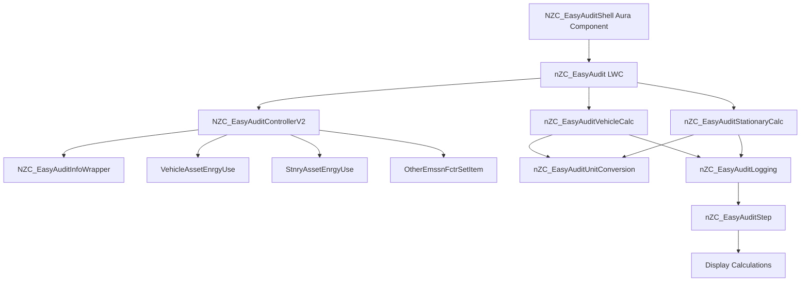

# 📊 NZC EasyAudit

> **A comprehensive audit component that displays step-by-step emissions calculations for vehicle and stationary energy use records in Salesforce Net Zero Cloud**

[](https://salesforce.com)
[](https://help.salesforce.com/s/articleView?id=sf.net_zero_cloud_intro.htm)
[](https://developer.salesforce.com/docs/platform/lwc/guide)

## 🚀 Quick Deploy

<div align="center">

[](https://githubsfdeploy.herokuapp.com?owner=jvillalpando_sfemu&repo=NZC-EasyAudit&ref=main)

**One-click deployment to your Salesforce org**

> **Note:** You'll need to authenticate with your Salesforce org. Alternatively, use the [Salesforce CLI deployment method](#-option-3-salesforce-cli-deployment) below.

</div>

---

## ✨ Features

### 📊 **Emissions Calculation Display**

- **Step-by-Step Calculations**: Displays detailed, step-by-step emissions calculations in an easy-to-understand accordion format
- **Vehicle Energy Use Support**: Calculates emissions for vehicle energy use records including fuel consumption, distance, and flight duration
- **Stationary Energy Use Support**: Calculates emissions for stationary energy use records including electricity, refrigerants, and various fuel types
- **Multiple Fuel Types**: Supports electricity, diesel, natural gas, propane, kerosene, and many other fuel types

### 🔄 **Unit Conversion & Custom Fuels**

- **Automatic Unit Conversion**: Handles unit conversions for fuel consumption, distance, and area measurements
- **Custom Fuel Support**: Supports custom fuel types and units with automatic conversion calculations
- **Emission Factor Integration**: Integrates with Net Zero Cloud emission factors for accurate calculations

### 🎯 **User Experience**

- **Interactive Accordion UI**: Expandable accordion interface for easy navigation through calculation steps
- **Real-Time Calculations**: Performs calculations client-side for instant results
- **Comprehensive Logging**: Detailed logging of calculation steps for audit purposes
- **Lightning Web Components**: Modern, responsive UI built with Lightning Web Components

---

## 🚀 Getting Started

### 📋 Prerequisites

Before you begin, ensure you have the following:

- ✅ **Salesforce Net Zero Cloud** licensed and configured
- ✅ **Git** installed on your local machine
- ✅ **Salesforce CLI** (latest version recommended)
- ✅ **Salesforce user** with deployment permissions
- ✅ **Active Salesforce org** (Sandbox or Developer Edition)
- ✅ **VehicleAssetEnrgyUse or StnryAssetEnrgyUse records** in your org for testing

### 🔧 Installation

Choose your preferred deployment method:

#### 🎯 Option 1: One-Click GitHub Deploy _(Recommended)_

Click the **"Deploy to Salesforce"** button above for instant deployment to your org.

#### 📦 Option 2: Workbench Deployment

For environments where GitHub access is restricted:

1. **Download** the pre-built deployment package:
   - Direct download: [NZC-EasyAudit-Deploy.zip](./NZC-EasyAudit-Deploy.zip)
   - Or download from the [GitHub Releases](https://github.com/jvillalpando_sfemu/NZC-EasyAudit/releases) tab
2. **Navigate** to [Salesforce Workbench](https://workbench.developerforce.com/login.php)
3. **Login** to your target org
4. **Go to** Migration → Deploy
5. **Upload** the zip file and deploy

**Alternative Tools:** You can also deploy using [Salesforce Inspector](https://chrome.google.com/webstore/detail/salesforce-inspector/aodjmnfhjibkcdimpodiifdjnnncaafh) or the [Ant Migration Tool](https://developer.salesforce.com/docs/atlas.en-us.daas.meta/daas/forcemigrationtool_install.htm).

#### 🛠️ Option 3: Salesforce CLI Deployment

For developers who prefer command-line tools:

##### 3.1 Clone the Repository

```bash
git clone https://github.com/jvillalpando_sfemu/NZC-EasyAudit.git
cd NZC-EasyAudit
```

##### 3.2 Authorize Your Org

```bash
# For sandbox/production orgs
sfdx auth:web:login --setalias MyOrg --instanceurl https://test.salesforce.com

# For developer orgs
sfdx auth:web:login --setalias MyOrg
```

##### 3.3 Deploy the Metadata

```bash
# Deploy all components (Salesforce CLI v2)
sf project deploy start --source-dir force-app --target-org MyOrg

# Or using legacy sfdx command
sfdx force:source:deploy -p force-app -u MyOrg

# Or use CumulusCI (if configured)
cci flow run dev_org --org dev
```

**Note:** This accelerator is compatible with CI/CD tools like Gearset, Copado, and Flosum.

#### ⚡ Post-Deployment Configuration

After deploying with any method above, complete these manual steps:

> **📖 For detailed post-deployment configuration, see the [Admin Quick Start Guide](docs/admin-quick-start.md) or [Complete Admin Setup Guide](docs/admin-setup.md)**

1. **Add Component to Lightning Pages**
   - Navigate to Setup → Lightning App Builder
   - Edit the Vehicle Energy Use or Stationary Energy Use Lightning page
   - Add the `NZC_EasyAuditShell` component to the page
   - Save and activate the page

2. **Configure Security**
   - Assign the `NZC EasyAudit Access` permission set to users
   - Configure object and field permissions (see [Admin Setup Guide](docs/admin-setup.md#security-configuration))

3. **Test with Sample Records**
   - Create or use existing VehicleAssetEnrgyUse or StnryAssetEnrgyUse records
   - Navigate to a record detail page
   - Verify the EasyAudit component displays correctly

---

## 🎯 Usage

> **📖 For detailed usage instructions, see the [User Guide](docs/user-guide.md)**

### 📱 **Adding the Component to Lightning Pages**

> **📖 Detailed instructions: [Admin Setup Guide - Lightning Page Configuration](docs/admin-setup.md#lightning-page-configuration)**

1. **Navigate** to Setup → Lightning App Builder
2. **Select** the Vehicle Energy Use or Stationary Energy Use Lightning page
3. **Edit** the page
4. **Find** the `NZC_EasyAuditShell` component in the Custom Components section
5. **Drag** the component to your desired location on the page
6. **Save** and **Activate** the page

### 🔍 **Viewing Emissions Calculations**

> **📖 Complete user guide: [User Guide](docs/user-guide.md)**

1. **Navigate** to a VehicleAssetEnrgyUse or StnryAssetEnrgyUse record
2. **Locate** the EasyAudit component on the record page
3. **Expand** the accordion sections to view step-by-step calculations
4. **Review** the detailed calculation steps including:
   - Fuel consumption and unit conversions
   - Emission factor applications
   - Scope 1, 2, and 3 emissions calculations
   - Final emissions totals

### 📊 **Understanding the Calculations**

The component displays calculations in an accordion format, showing:
- **Input Values**: Original fuel consumption, distance, and other input data
- **Unit Conversions**: Automatic conversions between different unit systems
- **Emission Factors**: Applied emission factors from Net Zero Cloud
- **Calculation Steps**: Detailed mathematical steps for each calculation
- **Final Results**: Total emissions broken down by scope and gas type

---

## 🏗️ Technical Architecture

This accelerator contains the following metadata:

- **6 Lightning Web Components** (`nZC_EasyAudit`, `nZC_EasyAuditStep`, `nZC_EasyAuditVehicleCalc`, `nZC_EasyAuditStationaryCalc`, `nZC_EasyAuditUnitConversion`, `nZC_EasyAuditLogging`)
- **3 Apex Classes** (`NZC_EasyAuditControllerV2`, `NZC_EasyAuditConstants`, `NZC_EasyAuditInfoWrapper`)
- **1 Apex Test Class** (`NZC_EasyAuditControllerV2Test`)
- **1 Aura Component** (`NZC_EasyAuditShell`)

### 🔒 Security & Code Quality

- **API Version**: All components use API version 65.0 for compatibility with latest Salesforce features
- **Security**: All SOQL queries use `WITH USER_MODE` to enforce user-level CRUD and field-level security (FLS)
- **Code Quality**: Integrated with Salesforce Code Analyzer for continuous code quality monitoring
- **Best Practices**: Follows Salesforce coding standards and Apex best practices

### Architecture Diagram



### 🧩 **Key Components**

| Component                    | Description                                                |
| ---------------------------- | ---------------------------------------------------------- |
| `nZC_EasyAudit`              | Main Lightning Web Component that orchestrates the audit display and calculation flow |
| `NZC_EasyAuditControllerV2`  | Apex controller that retrieves and processes energy use record data |
| `NZC_EasyAuditInfoWrapper`   | Apex wrapper class that structures data for calculation components |
| `nZC_EasyAuditVehicleCalc`   | JavaScript class that performs vehicle energy use emissions calculations |
| `nZC_EasyAuditStationaryCalc`| JavaScript class that performs stationary energy use emissions calculations |
| `nZC_EasyAuditStep`          | Lightning Web Component that displays individual calculation steps in accordion format |
| `nZC_EasyAuditUnitConversion`| Utility class for handling unit conversions between different measurement systems |
| `NZC_EasyAuditShell`         | Aura component wrapper that enables the LWC to be added to Lightning pages |

---

## 🤝 Contributing

We welcome contributions to improve the NZC EasyAudit! Please follow these steps:

1. **Fork** the repository
2. **Create** a feature branch (`git checkout -b feature/amazing-feature`)
3. **Commit** your changes (`git commit -m 'Add amazing feature'`)
4. **Push** to the branch (`git push origin feature/amazing-feature`)
5. **Open** a Pull Request

### 📝 **Development Guidelines**

- Follow [Salesforce coding standards](https://developer.salesforce.com/docs/atlas.en-us.apexcode.meta/apexcode/apex_classes_best_practices.htm)
- Include comprehensive test coverage (>75%)
- Update documentation for new features
- Test thoroughly in multiple org types
- Ensure calculations match Net Zero Cloud emission factor standards

### 🤖 **AI Coding Assistant Support**

This repository is optimized for AI-powered development with both **Cursor IDE** and **Claude Code**:

- **Cursor IDE**: Uses rules in [`.cursor/rules/`](./.cursor/rules/) for automated coding standards
- **Claude Code**: Follows [CLAUDE.md](./CLAUDE.md) which references the same shared rules
- **Shared Standards**: Both tools use the same [REPOSITORY_SUMMARY.md](./REPOSITORY_SUMMARY.md) for project context

**Key Resources for AI Assistants**:
- [CLAUDE.md](./CLAUDE.md) - Main instructions for Claude Code
- [REPOSITORY_SUMMARY.md](./REPOSITORY_SUMMARY.md) - Complete project overview and architecture
- [.cursor/rules/](./.cursor/rules/) - Comprehensive coding standards (LWC, Apex, testing, documentation)
- [SKILLS.md](./SKILLS.md) - Interactive skills for complex workflows

**Available Skills**:
- `/readme-generate` - Generate OSPO-compliant README files
- `/prepare-opensource` - Validate compliance and prepare for publication

Skills provide interactive workflows for common tasks. See [SKILLS.md](./SKILLS.md) for complete documentation.

---

## 📄 License

This project is licensed under the **Apache License 2.0** - see the [LICENSE.md](LICENSE.md) file for details.

---

## 🐛 How to Report Bugs

Found a bug or have a feature request? Please report it via [GitHub Issues](https://github.com/jvillalpando_sfemu/NZC-EasyAudit/issues).

When reporting bugs, please include:

- Steps to reproduce the issue
- Expected vs. actual behavior
- Salesforce org version and edition
- Net Zero Cloud version (if applicable)
- Screenshots or error messages (if applicable)

## 📚 Documentation

Comprehensive documentation is available in the [`docs/`](docs/) folder:

- **[Admin Quick Start](docs/admin-quick-start.md)** - Get up and running in 15 minutes
- **[Complete Admin Setup Guide](docs/admin-setup.md)** - Detailed configuration instructions
- **[Admin Configuration Guide](docs/admin-configuration.md)** - Advanced configuration options
- **[Admin Troubleshooting Guide](docs/admin-troubleshooting.md)** - Solutions to common issues
- **[User Guide](docs/user-guide.md)** - End user documentation

## 🆘 Support

- 📚 **Documentation**: Check the [docs folder](docs/) for comprehensive guides
- 🐛 **Issues**: Report bugs via [GitHub Issues](https://github.com/jvillalpando_sfemu/NZC-EasyAudit/issues)
- 💬 **Discussions**: Join the conversation in [GitHub Discussions](https://github.com/jvillalpando_sfemu/NZC-EasyAudit/discussions)
- 📧 **Contact**: Reach out to the maintainers for enterprise support

## ⚠️ Disclaimer

**This accelerator is open-source, not an official Salesforce product, and is community-supported.** Salesforce does not provide official support for this accelerator. Use at your own risk and test thoroughly in a sandbox environment before deploying to production.

---

<div align="center">

**Made with ❤️ for the Salesforce Community**

⭐ **Star this repo** if you find it helpful!

</div>
