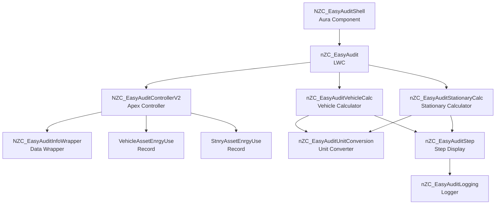

# 📊 NZC Easy Audit

> **A powerful Lightning component solution for displaying step-by-step emissions calculations and audit instructions in Salesforce Net Zero Cloud**

[](https://salesforce.com)
[](https://help.salesforce.com/s/articleView?id=sf.net_zero_cloud_intro.htm)
[](https://developer.salesforce.com/docs/platform/lwc/guide)

## 🚀 Quick Deploy

<div align="center">

[](https://githubsfdeploy.herokuapp.com?owner=jvillalpando_sfemu&repo=NZC-EasyAudit&ref=main)

**One-click deployment to your Salesforce org**

> **Note:** You'll need to authenticate with your Salesforce org credentials. Alternatively, use the [Salesforce CLI deployment method](#-option-3-salesforce-cli-deployment) below.

</div>

---

## ✨ Features

### 📊 **Emissions Calculations**

- **Vehicle Emissions Tracking**: Automatically calculates emissions for vehicle energy use records with detailed step-by-step instructions
- **Stationary Emissions Tracking**: Provides comprehensive calculations for stationary asset energy use records
- **Real-time Calculations**: Displays emissions calculations dynamically based on record data
- **Multi-Unit Support**: Handles various unit conversions for fuel consumption, distance, and emissions factors

### 🎯 **User Experience**

- **Step-by-Step Instructions**: Interactive accordion interface showing detailed calculation steps
- **Visual Audit Trail**: Clear presentation of calculation methodology and formulas
- **Record Context Aware**: Automatically detects record type (Vehicle or Stationary) and displays appropriate calculations
- **Lightning Web Components**: Modern, responsive UI built with Lightning Web Components

### 🔧 **Technical Capabilities**

- **Custom Fuel Type Support**: Handles custom fuel types and units with automatic conversion
- **Emission Factor Integration**: Seamlessly integrates with Net Zero Cloud emission factor sets
- **Comprehensive Logging**: Detailed logging capabilities for calculation debugging and audit purposes
- **Unit Conversion Engine**: Advanced unit conversion for various measurement systems

---

## 🚀 Getting Started

### 📋 Prerequisites

Before you begin, ensure you have the following:

- ✅ **Salesforce Net Zero Cloud** licensed and configured
- ✅ **Git** installed on your local machine
- ✅ **Salesforce CLI** (latest version recommended)
- ✅ **Salesforce user** with deployment permissions
- ✅ **Active Salesforce org** (Sandbox or Developer Edition)
- ✅ **VehicleAssetEnrgyUse** or **StnryAssetEnrgyUse** records** in your org for testing

### 🔧 Installation

Choose your preferred deployment method:

#### 🎯 Option 1: One-Click GitHub Deploy _(Recommended)_

Click the **"Deploy to Salesforce"** button above for instant deployment to your org.

#### 📦 Option 2: Workbench Deployment

For environments where GitHub access is restricted:

1. **Download** the pre-built deployment package:
   - Direct download: [NZC-EasyAudit-Deploy.zip](./NZC-EasyAudit-Deploy.zip)
   - Or download from the [GitHub Releases](https://github.com/jvillalpando_sfemu/NZC-EasyAudit/releases) tab
2. **Navigate** to [Salesforce Workbench](https://workbench.developerforce.com/login.php)
3. **Login** to your target org
4. **Go to** Migration → Deploy
5. **Upload** the zip file and deploy

**Alternative Tools:** You can also deploy using [Salesforce Inspector](https://chrome.google.com/webstore/detail/salesforce-inspector/aodjmnfhjibkcdimpodiifdjnnncaafh) or the [Ant Migration Tool](https://developer.salesforce.com/docs/atlas.en-us.daas.meta/daas/forcemigrationtool_install.htm).

#### 🛠️ Option 3: Salesforce CLI Deployment

For developers who prefer command-line tools:

##### 3.1 Clone the Repository

```bash
git clone https://github.com/jvillalpando_sfemu/NZC-EasyAudit.git
cd NZC-EasyAudit
```

##### 3.2 Authorize Your Org

```bash
# For sandbox/production orgs
sf org login web --alias MyOrg --instance-url https://test.salesforce.com

# For developer orgs
sf org login web --alias MyOrg
```

##### 3.3 Deploy the Metadata

```bash
# Deploy all components (Salesforce CLI v2)
sf project deploy start --source-dir force-app --target-org MyOrg

# Or using legacy sfdx command
sfdx force:source:deploy -p force-app -u MyOrg
```

**Note:** This accelerator is compatible with CI/CD tools like Gearset, Copado, and Flosum.

#### ⚡ Post-Deployment Configuration

After deploying with any method above, complete these manual steps:

1. **Verify Component Deployment**
   - Navigate to Setup → Custom Code → Lightning Components
   - Confirm `NZC_EasyAuditShell` Aura component is available
   - Verify all Lightning Web Components are deployed

2. **Add Component to Lightning Pages**
   - Navigate to the Vehicle Energy Use or Stationary Energy Use record page
   - Edit the page using Lightning App Builder
   - Find `NZC_EasyAuditShell` in the Custom Components section
   - Drag the component to your desired location
   - Save and activate the page

3. **Test with Sample Records**
   - Create or navigate to a VehicleAssetEnrgyUse record
   - Verify the component displays calculation steps
   - Test with a StnryAssetEnrgyUse record to see stationary calculations

4. **Configure Permissions (if needed)**
   - Ensure users have access to VehicleAssetEnrgyUse and StnryAssetEnrgyUse objects
   - Verify field-level security allows access to required fields

---

## 🎯 Usage

### 📱 **Adding the Component to Lightning Pages**

1. **Navigate** to Setup → Object Manager → Vehicle Asset Energy Use (or Stationary Asset Energy Use)
2. **Click** on Lightning Record Pages
3. **Select** the page you want to edit (or create a new one)
4. **Click** Edit to open Lightning App Builder
5. **Find** the `NZC_EasyAuditShell` component in the Custom Components section
6. **Drag** the component to your desired location on the page
7. **Save** and **Activate** the page

### 🔄 **Viewing Emissions Calculations**

1. **Navigate** to a VehicleAssetEnrgyUse or StnryAssetEnrgyUse record
2. **Scroll** to the section where you added the NZC_EasyAuditShell component
3. **View** the step-by-step calculation instructions displayed in accordion format
4. **Expand** any step to see detailed calculation methodology
5. **Review** the emissions calculations and formulas

### 📊 **Understanding the Calculations**

- **Vehicle Calculations**: Shows fuel consumption, distance, emission factors, and resulting emissions
- **Stationary Calculations**: Displays energy consumption, emission factors, and calculated emissions
- **Unit Conversions**: Automatically handles unit conversions for different measurement systems
- **Custom Fuel Types**: Supports custom fuel types with appropriate conversion factors

---

## 🏗️ Technical Architecture

This accelerator contains the following metadata:

- **1 Aura Component** (`NZC_EasyAuditShell`)
- **6 Lightning Web Components** (`nZC_EasyAudit`, `nZC_EasyAuditLogging`, `nZC_EasyAuditStationaryCalc`, `nZC_EasyAuditStep`, `nZC_EasyAuditUnitConversion`, `nZC_EasyAuditVehicleCalc`)
- **4 Apex Classes** (`NZC_EasyAuditConstants`, `NZC_EasyAuditControllerV2`, `NZC_EasyAuditControllerV2Test`, `NZC_EasyAuditInfoWrapper`)

### Architecture Diagram



### 🧩 **Key Components**

| Component                    | Description                                                |
| ---- | ---- |
| `NZC_EasyAuditShell`         | Aura component wrapper that implements record page interface and passes recordId to LWC |
| `nZC_EasyAudit`              | Main Lightning Web Component that orchestrates calculation display and determines record type |
| `NZC_EasyAuditControllerV2`  | Apex controller that retrieves record data and processes vehicle/stationary energy use information |
| `NZC_EasyAuditInfoWrapper`  | Data wrapper class that structures record information for calculation processing |
| `nZC_EasyAuditVehicleCalc`   | JavaScript class that performs vehicle emissions calculations and generates step-by-step instructions |
| `nZC_EasyAuditStationaryCalc`| JavaScript class that performs stationary emissions calculations and generates step-by-step instructions |
| `nZC_EasyAuditStep`          | Lightning Web Component that displays individual calculation steps in accordion format |
| `nZC_EasyAuditUnitConversion`| Utility class for handling unit conversions across different measurement systems |
| `nZC_EasyAuditLogging`       | Logging utility for debugging and audit trail purposes |

---

## 🤝 Contributing

We welcome contributions to improve the NZC Easy Audit! Please follow these steps:

1. **Fork** the repository
2. **Create** a feature branch (`git checkout -b feature/amazing-feature`)
3. **Commit** your changes (`git commit -m 'Add amazing feature'`)
4. **Push** to the branch (`git push origin feature/amazing-feature`)
5. **Open** a Pull Request

### 📝 **Development Guidelines**

- Follow [Salesforce coding standards](https://developer.salesforce.com/docs/atlas.en-us.apexcode.meta/apexcode/apex_classes_best_practices.htm)
- Include comprehensive test coverage (>75%)
- Update documentation for new features
- Test thoroughly in multiple org types
- Follow [Lightning Web Component best practices](https://developer.salesforce.com/docs/component-library/documentation/en/lwc/lwc.get_started_best_practices)

---

## 📄 License

This project is licensed under the **MIT License** - see the [LICENSE.md](LICENSE.md) file for details.

---

## 🐛 How to Report Bugs

Found a bug or have a feature request? Please report it via [GitHub Issues](https://github.com/jvillalpando_sfemu/NZC-EasyAudit/issues).

When reporting bugs, please include:

- Steps to reproduce the issue
- Expected vs. actual behavior
- Salesforce org version and edition
- Net Zero Cloud version (if applicable)
- Screenshots or error messages (if applicable)

## 🆘 Support

- 📚 **Documentation**: Check our [Wiki](https://github.com/jvillalpando_sfemu/NZC-EasyAudit/wiki) for detailed guides
- 🐛 **Issues**: Report bugs via [GitHub Issues](https://github.com/jvillalpando_sfemu/NZC-EasyAudit/issues)
- 💬 **Discussions**: Join the conversation in [GitHub Discussions](https://github.com/jvillalpando_sfemu/NZC-EasyAudit/discussions)
- 📧 **Contact**: Reach out to the maintainers for enterprise support

## ⚠️ Disclaimer

**This accelerator is open-source, not an official Salesforce product, and is community-supported.** Salesforce does not provide official support for this accelerator. Use at your own risk and test thoroughly in a sandbox environment before deploying to production.

---

<div align="center">

**Made with ❤️ for the Salesforce Community**

⭐ **Star this repo** if you find it helpful!

</div>
